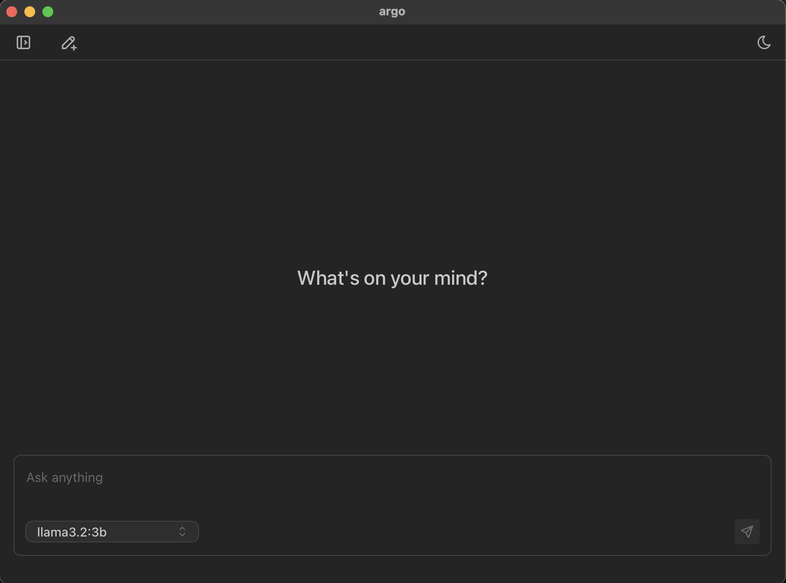
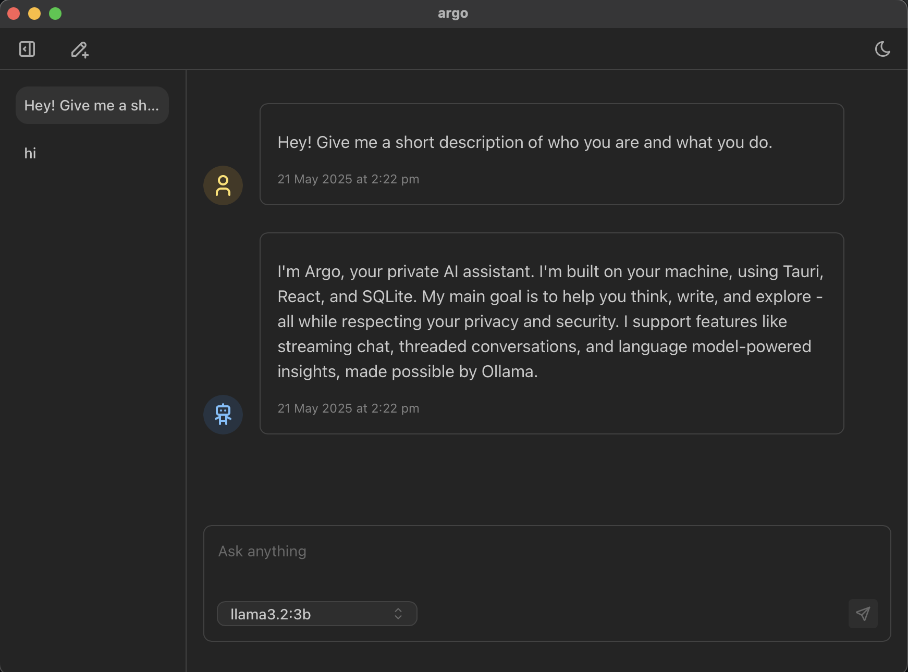

# 🧠 Argo: Chat with local LLMs on Ollama

**Argo** is a local-first, minimalistic desktop client for threaded conversations with your own local LLMs via [Ollama](https://ollama.com/). Built with **Tauri,** **Rust, React,** and **SQLite**, Argo runs entirely offline — prioritizing speed, privacy, and control.

This project assumes [Ollama](https://ollama.com/) is installed and running locally with at least one model available (e.g., LLaMA3, Qwen).

## 🎥 Demo


https://github.com/user-attachments/assets/9f69c8f3-0f1b-464b-addf-f85a74ff6b75


## ✨ Features

* ⚡ **Streaming responses** from any Ollama-supported local model
* 🧵 **Threaded conversations** with persistent local history
* 🧠 **Local model picker** (choose between your installed Ollama models)
* 📝 **Markdown rendering** for rich responses
* 🌗 **Light/dark mode** support
* 💾 **SQLite persistence** for threads and messages — fully offline

---

## 📦 Getting Started

1. Install [Ollama](https://ollama.com/) and ensure it's running locally.
2. Install [Tauri dependencies](https://tauri.app/start/prerequisites/).
3. Clone this repo and install JavaScript dependencies:

   ```bash
   pnpm install
   ```
4. Run the app in dev mode:

   ```bash
   pnpm tauri dev
   ```
5. To build a local desktop binary:

   ```bash
   pnpm tauri build
   ```
6. Follow Tauri's OS-specific setup instructions to install the built app.

> ⚠️ A proper downloadable app release is coming soon.

---

## 🧱 Tech Stack

| Layer     | Stack                                                                |
| --------- | -------------------------------------------------------------------- |
| Frontend  | React + TypeScript + Mantine + TanStack Query (inside a Tauri shell) |
| Backend   | Rust + Tauri commands +`sqlx`for async SQLite                      |
| Model API | [Ollama](https://ollama.com/) — local LLMs like LLaMA3, Qwen, etc.      |
| Storage   | SQLite — for threads, messages, and (soon) vector embeddings        |

---

## 🔜 Roadmap

> What's next? These features are planned or in-progress:
* [ ] **Downloadable app releases** (installers per OS)
* [ ] **Chat with uploaded `.txt` and `.md` files**
* [ ] **RAG (Retrieval-Augmented Generation)** on uploaded content
* [ ] **Settings sidebar** to tune model parameters (temperature, top_p, etc.)
* [ ] **MCP integration** for tool calls using the Model Context Protocol


---

## 🧠 Philosophy

Argo is designed to be:

* **Small** — fast and lean with no server-side dependencies
* **Private** — everything runs locally; your data never leaves your machine
* **Transparent** — SQLite, open APIs, no tracking, no mystery boxes

It's a thoughtful tool designed to help you explore ideas, reflect, and create — entirely on your own terms.

---

## 📸 Screenshots







## 🧑‍💻 Contributing

Contributions are welcome! See the roadmap or open an issue to suggest features or improvements.

---

## ⚖ License

MIT
